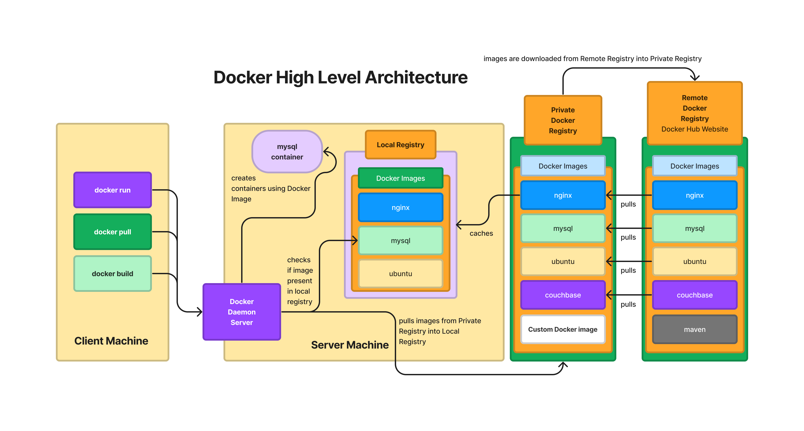

# Day 1

## Info - Hypervisor Overview
<pre>
- is Virtualization technology
- this helps us run multiple OS on the same Laptop/Desktop/Workstation/Server
- i.e more than one OS can be actively running side by side
- let's we have a laptop with Quad Core CPUs, 8GB RAM and 500GB HDD/SDD, 
  how many maximum Virtual Machines this laptop would support ?
  - the deciding/limiting factor is the Processor supports how many CPU Cores?
  - 4 x 2 = 8 virtual cores you have, which mean total OS that can run on this laptop is limited to 8 ( 1 Host OS +  7 Virtual Machines)
  - with the help of HyperThreading feature, each Physical CPU Core supports running 2 parallel threads, hence they are seen/considered as two virtual/logical Core by the Hypervisor software
  - We could install any Operating System within a Virtual Machine and they are called as Guest OS
- there are 2 types of Hypervsisorts
  1. Type 1 ( a.k.a Bare-Metal Hypervisors )
  2. Type 2 ( a.k.a Hosted Hypervsiors
- In order to do install any Hypervisor, we need a machine that supports Processor with Virtualization support
  - In case of Intel Processor, the virtualization feature set is called VT-X
  - In case of AMD Processor, the virtualization feature set is called AMD-V
- Type 1
  - is meant to be used in Workstations and Servers
  - this type of Hypervisor comes with a minimal OS, hence we don't need to install Host OS, instead we can directly install the Hypervisor
  - examples
    - VMWare vSphere(vCenter)
    - Microsoft Hyper-V
    - Linux KVM
- Type 2
  - can be installed on top a Host OS ( Linux, Windows or Mac OS )
  - is meant to be used in Laptops, Desktops and Workstations
  - examples
    - VMware Workstation ( supported in Linux and Windows )
    - VMWare Fusion ( supported in Mac OS-X )
    - Parallels ( supports in Mac OS-X )
    - Oracle VirtualBox ( supported in Windows, Linux and Mac OS-X )
- this virtualization technoloyg disrupted the way the IT industry works
- irrespective of Company size, pretty every organization started using this virtualization technology, which resulted in huge
  cost saving
- Server consolidation is possible with Virtualization Technoloyy
- Modern high-end servers could host 2000+ virtual machines in a single server these days
- Though the virtualization technology resulted in huge cost-saving, it has not brought the cost to the extent that every
  engineer can be provided with 10~15 VMs
- Developers would need to test their feature in different OS
- QA team may have test the product on multiple OS 
- In production environment, different software component like Web/App Servers, DB Servers, would require separate OS that runs in a separate VM/Physical Machine
- This type of Virtualization is called Heavy weight Virtualization
  - each VM must be allocated with dedicated Hardware resources
    - CPU cores
    - RAM
    - Storage Hard disk / SSD 
  - each VM, represents one fully functional Operating System
  - each Guest OS that runs on the VM, has its own Network Stack, Network Cards, it has its own OS Kernel, etc.,
</pre>

## Info - Containerization
<pre>
- it is an application virtualization technology
- this is light-weigth virtualization, as container does't required dedicated hardware resources
- in other words, all containers that runs in the same machine/os shares the hardware resources on the underlying Host/Guest OS
- each container represents one application process not an Operating System
- technically, comparing a container with Virtual Machine, Guest OS or Host OS is ideally wrong
- Linux Kernels supports 2 interesting features, which are required by any Container Engine/Runtime
  - Control Groups ( CGroups )
    - this helps applying resource quota restrictions on individual container level
    - for example
      - using CGroups, we can restrict how many CPUs one container can use at the max at point of time
      - using CGroups, we can restrict how much RAM a container can use at the max
      - using CGroups, we can restrict how mauch disk space a container can be utilizat at the max
      - all these helps, one container use up all the storage, cpu or RAM etc, leaving no resources for other containers
  - Namespace
    - this helps isolating one container from the other
- the reason why, people tend to compare an Operating System or Virtual Machine with container technology is for the following reasons
  - each container has its own dedicated Network Stack ( Software defined Network Stack - Virtual )
  - each container has its own dedicated NIC ( Network Card )
  - each container acquires one or more IP Address ( mostly Private IPs ), depending on how many Network Cards it has 
  - every container uses about 7~8 namespaces
- We need to understand two different software related to Container Technology
  1. Container Runtime
  2. Container Engine
</pre>


## Info - Container Runtime
<pre>
- Container Runtimes depend on the Linux Kernel features i.e CGroups and Namespace
- Container Runtimes helps us manage Container Images and Containers
- they are low-level software, hence they are not directly used by end-users like us as they are not so user-friendly
- examples
  - cRun
  - runC
  - CRI-O
</pre>

## Info - Container Engine
<pre>
- They are high-level, user-friendly softwares that helps us manage Container Images and Containers
- Container Engine, internally depends on Container Runtime to manage Container Images and Containers
- examples
  - Docker - depends on Containerd, which in-turn depends on runC Container Runtime
  - Podman - depends on CRI-O container Runtime
  - Containerd - depends on runC Container Runtime
</pre>

## Info - Container Image
<pre>
- is the blueprint of a Container, similar to OS ISO files we download for installing Ubuntu or Windows OS
- using a Container Image, we can create multiple containers
- Container Image names might in some case resemble like an OS, they Container Images don't represent a OS
  - OS Container Image will have mostly the following software tools
    - Package Manager 
      - used to install/uninstall/upgrade softwares
    - comes with minimal linux commands
    - never comes with OS Kernel or full sets of linux commands
- Container Images are conservatively built to reduce the size of image, hence few commands are supported within a container
- Usually Container Image will have
  - One main application with all its dependent libraries and Web/App Servers(if required) to run one single application
</pre>


## Info - Containers
<pre>
- Container is a running instance of a Container Image
- Whatever softwares were pre-installed, pre-configured in the Container Image are available in the Container
- Each container gets it own IP Address
- Each container gets it own File System ( folders and utilities )
- Each container gets it own Port Range ( 0 to 65535 Porst just like an OS )
- General Recommned practive
  - One main application per Container
- examples
  - mysql container
  - weblogic contianer
  - microservice
  - web server
  - app server
  - REST API
  - SOAP API
</pre>

## Info - Docker Registry
<pre>
- Docker Registry is a collection of many Docker Images
- There are 3 types of registries
  1. Local Docker Registry ( /var/lib/docker folder in Linux )
  2. Private Docker Registery ( could be setup using JFrog Artifactory or Sonatype Nexus )
  3. Docker Hub - Remote Registry ( Docker Hub Website )
</pre>

## Info - Docker Overview
<pre>
- Docker is developed in Golang by an organization called Docker Inc
- comes in 2 flavours
  1. Docker Community Edition - Docker CE ( opensource )
  2. Docker Enterprise Edition- Docker EE ( requires license )
     - comes with enterpise registry with access to certified Docker images ( access to Docker certified images )
     - world-wide support from Docker Inc
- it follows Client/Server Architecture
  - docker - is the client tool
  - dockerd - is the Docker Server that runs as a background service 
- In local machines, docker client and server communicates by default using a socket
- In remote machines, docker client and server communicates using REST API
</pre>

## Info - Docker High-Level Architecture



## Demo - Installing Docker Community Edition ( Docker is already installed in our lab machine - hence you don't need to install it )
```
# Add Docker's official GPG key:
sudo apt update
sudo apt install ca-certificates curl
sudo install -m 0755 -d /etc/apt/keyrings
sudo curl -fsSL https://download.docker.com/linux/ubuntu/gpg -o /etc/apt/keyrings/docker.asc
sudo chmod a+r /etc/apt/keyrings/docker.asc

# Add the repository to Apt sources:
sudo tee /etc/apt/sources.list.d/docker.sources <<EOF
Types: deb
URIs: https://download.docker.com/linux/ubuntu
Suites: $(. /etc/os-release && echo "${UBUNTU_CODENAME:-$VERSION_CODENAME}")
Components: stable
Signed-By: /etc/apt/keyrings/docker.asc
EOF

sudo apt update

sudo apt install docker-ce docker-ce-cli containerd.io docker-buildx-plugin docker-compose-plugin -y

sudo systemctl enable docker
sudo systemctl start docker
sudo systemctl status docker

sudo usermod -aG docker $USER
id
sudo su $USER
id
docker --version
docker info
docker images
```

