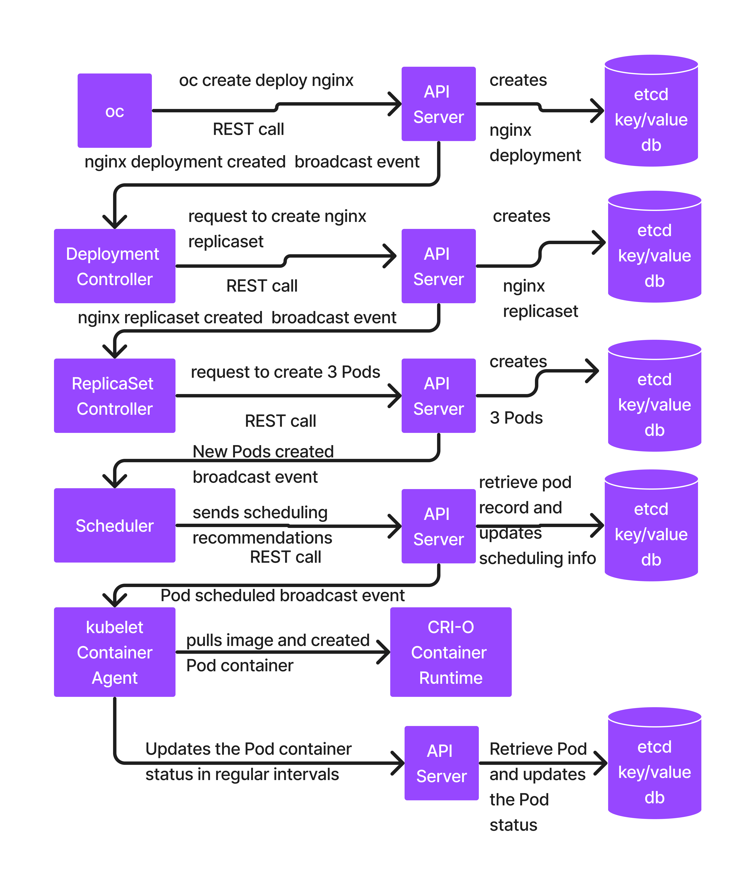

# Day 4

## Info - Openshift Images
<pre>
image-registry.openshift-image-registry.svc:5000/openshift/nginx:1.27
image-registry.openshift-image-registry.svc:5000/openshift/nginx:1.28
image-registry.openshift-image-registry.svc:5000/openshift/nginx:1.29
image-registry.openshift-image-registry.svc:5000/openshift/wordpress:latest
image-registry.openshift-image-registry.svc:5000/openshift/mariadb:12.0.2
</pre>

## Info - What happens internally in Openshift when we deploy an application
```
oc create deploy nginx --image=docker.io/bitnamilegay/nginx:latest --replicas=3
```

Note
<pre>
- oc client tool makes a REST call to API Server requesting the API Server to create a deployment
- Once API Server receives the request from oc client, it creates a Deployment database entry in etcd database
- API Server then sends broadcasting event saying new Deployment created along with deployment details
- Deployment Controller receives this event, it then makes a REST call to API Server requesting it to create a ReplicaSet for the nginx deployment
- API Server creates a ReplicaSet db entry(new record) in the etcd database
- API Server sends a broadcast event saying new ReplicaSet created
- ReplicaSet Controller receives the event, it then makes a REST call to API Server requesting it to create 3 Pods
- API Server create 3 Pod records in the etcd database
- API Server sends broadcast event for each new Pod created in the etcd database
- Scheduler receives the event, it then identifies a healthy node where the new Pod can be deployed
- Scheduler makes a REST call to API Server to send it scheduling recommendataion. This will be done for each Pod.
- API Server receives the scheduling recommendations from Scheduler, it then retrieves the Pod record from etcd and updates it status as Scheduled to so and so node
- API Server sends a broadcasting event saying Pod1 scheduled to Worker01 node, this happens for each Pod.
- Kubelet Container Agent that runs on Worker01 node receives the event, it then pull the container image, creates and starts the container on Worker01
- Kubelet monitors the status of the Container created for Pod1, and it periodically updates the status back to API Server in a heart-beat fashion
- API Server receives these updates, retrieves the Pod database entry from etcd and updates the Pod status
</pre>



## Info - Openshift S2I
<pre>
- Unlike Kubernetes, Openshift apart from deploying applications from readily available or pre-build container images, 
  one could deploy applications from source code from your version control
- Openshift S2I supports many different Strategies
  1. Docker
  2. Source
  3. Custom
  4. Pipeline(Jenkins/Tekton)
  5. Binary(S2I Binary)
</pre>


## Lab - Horizontal Pod Auto-scaling based on CPU utilization
```
oc delete project jegan
oc new-project jegan

cd ~
git clone https://github.com/tektutor/openshift-march-2026.git
cd openshift-march-2026
cd Day4/auto-scaling
oc create -f hello-deploy.yml --save-config
oc get pods
oc create -f hello-hpa.yml --save-config

oc expose deploy/nginx --port=8080
oc expose svc/nginx
oc get route
```

We need to stress the pod with more traffic
```
ab -k -n 200000 -c 500 https://nginx-jegan.apps.ocp4.palmeto.org/
```

## Lab - Preferred Node Affininty
```
cd ~/openshift-march-2026
git pull
cd Day4/node-affinity
cat preferred-node-affinity.yml
oc delete project jegan
oc new-project jegan

# Scenario - No nodes has label disk=ssd
oc apply -f preferred-node-affinity.yml
oc get nodes --show-labels
oc get pods -o yaml

# Scenario - Worker 3 has disk=ssd label
oc label node worker03.ocp4.palmeto.org disk=ssd
oc get pods -o wide
oc delete -f preferred-node-affinity.yml
oc apply -f preferred-node-affinity.yml
oc get pods -o wide
oc label node worker03.ocp4.palmeto.org disk-
oc get pods -o wide
oc delete -f preferred-node-affinity.yml

# Scenario - node matches the criteria
oc apply -f required-node-affinity.yml
oc get pods -o wide
oc label node worker03.ocp4.palmeto.org disk=ssd
oc get pods -o wide
```

## Lab - Ingress
Note
<pre>
- Ingress provides a public url to expose multiple services using certain rules like path as prefix
- Openshift Route uses Kubernetes Ingress under the hood
- Unlike Openshift Route which forwards the request to only one Service, Ingress generally forward the call to multiple services based on rules
- Ingress is a set of fowarding Rules
- Ingress Controller running in Openshift Cluster, keeps looking for Ingress rules written from any Project namespace
- Whenever Ingress Controller detects a new Ingress, or an existing ingress got updated or deleted it gets notifications via API Server events
- Ingress Controller retrieves the rules from Ingress and it configures the Load Balancer so the Ingress rules will start working
- for an Ingress to work in Kubernetes/Rancher/Openshift, 3 components should be there
  1. Ingress ( Rule )
  2. Ingress Controller 
     - Nginx Ingress Controller
     - HAProxy Ingress Controller
     - Traefik Ingress Controller
  3. Load Balancer 
     - Nginx Load Balancer
     - HAProxy Load Balancer
     - Traefik Load Balancer
</pre>

Let's do this hands-on exercise to understand how Ingress can be created. In order to try out this exercise, we need couple of deployments
```
oc delete project jegan
oc new-project jegan

cd ~/openshift-march-2026
git pull
cd Day4/ingress
ls -l

oc apply -f hello-deploy.yml
oc apply -f nginx-deploy.yml

oc apply -f hello-svc.yml
oc apply -f nginx-svc.yml

oc get deploy,svc

oc apply -f ingress.yml
oc get ingress
oc describe ingress/tektutor

curl http://tektutor.apps.ocp4.palmeto.org/nginx
curl http://tektutor.apps.ocp4.palmeto.org/hello
```

## Lab - Creating an edge route( https ) to secure your application running in Red Hat Openshift
```
oc delete project jegan
oc new-project jegan
# Server 1
oc create deploy nginx --image=image-registry.openshift-image-registry.svc:5000/openshift/nginx:1.29 --replicas=3

# Server 2
oc create deploy nginx --image=image-registry.openshift-image-registry.svc:5000/openshift/nginx:1.30 --replicas=3

openssl version
oc get pods
```

Find the base domain of your openshift cluster
```
oc get ingresses.config/cluster -o jsonpath={.spec.domain}
```

Let's generate a private key
```
openssl genrsa -out key.key
```

We need to create a public key using the private key for your organization domain
```
openssl req -new -key key.key -out csr.csr -subj="/CN=nginx-jegan.apps.ocp4.palmeto.org"
```

Sign the public key using the private key and generate certificate(.crt)
```
openssl x509 -req -in csr.csr -signkey key.key -out crt.crt
```

Let's create the edge(https) route to secure the application
```
oc get pods
oc get svc
oc expose deploy/nginx --port=8080
oc create route edge --service nginx --hostname nginx-jegan.apps.ocp4.palmeto.org --key key.key --cert crt.crt
```
